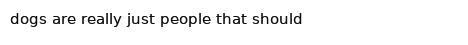

# Deep (Shower) Thought
**Teaching AI to have shower thoughts, trained with Reddit's r/Showerthoughts**

**tl;dr:** I tried to train a Deep Learning character model to have shower thoughts, using Reddit data. Instead it 
learned pithiness, curse words and clickbait-ing.  

## Background


*Given the seed `smart phones are today s version of the`, the algorithm completed the phrase with `friend to the millions`.*

Deep learning has drastically changed the way machines interact with human languages. From 
[machine translation](https://research.google.com/pubs/pub45610.html) to 
[textbook writing](https://newatlas.com/writing-algorithm/25539/), Natural Language Processing (NLP) — the branch of 
ML focused on human language models — has gone from sci-fi to [example code](https://github.com/keras-team/keras/tree/master/examples#text--sequences-examples). 

Though I've had some previous experience with linear NLP models and word level deep learning models, I wanted to learn 
more about building character level deep learning models. Generally, character level models look at a window of preceding 
characters, and try to infer the next character. Similar to repeatedly pressing auto-correct's top choice, this process 
can be repeated to generate a string of AI generated characters. 


Utilizing training data from [r/Showerthoughts](https://www.reddit.com/r/Showerthoughts/), and [starter code](https://github.com/keras-team/keras/blob/master/examples/lstm_text_generation.py)
from Keras, I built and trained a deep learning model that learned to generate new (and sometimes profound) shower 
thoughts. 
 
## Data

[r/Showerthoughts](https://www.reddit.com/r/Showerthoughts/) is an online message board, to "share those miniature 
epiphanies you have" while in the shower. These epiphanies include:
 
 - `Every machine can be utilised as a smoke machine if it is used wrong enough.`
 - `It kinda makes sense that the target audience for fidget spinners lost interest in them so quickly`
 - `Google should make it so that looking up "Is Santa real?" With safe search on only gives yes answers.`
 - `Machine Learning is to Computers what Evolution is to Organisms.`

I scraped all posts for a 100 day period in 2017 utilizing Reddit's [PRAW](https://praw.readthedocs.io/en/latest/) Python 
API wrapper. Though I was mainly interested in the `title` field, a long list of other fields were available, 
including:

| variable     | type   |
|--------------|--------|
| title        | string |
| selftext     | string |
| url          | string |
| ups          | int    |
| downs        | int    |
| score        | int    |
| num_comments | int    |
| over_18      | bool   |
| spoiler      | bool   |

Once I had the data set, I performed a set of standard data transformations, including:

 - Converted the string to a list of characters
 - Replacing all illegal characters with a space. 
 - Lowercase-ing all characters
 - Converting text into an `X` array containing a fixed length arrays of characters, and a `y` array, containing the 
 next character. 
 
For example `If my boss made me do as much homework as my kids' teachers make them, I'd tell him to go f...` 
 would become the `X`, `y` pair: `['i', 'f', ' ', 'm', 'y', ' ', 'b', 'o', 's', 's', ' ', 'm', 'a', 'd', 'e', ' ', 'm', 'e', ' ', 'd', 'o', ' ', 'a', 's', ' ', 'm', 'u', 'c', 'h', ' ', 'h', 'o', 'm', 'e', 'w', 'o', 'r', 'k', ' ', 'a', 's', ' ', 'm', 'y', ' ', 'k', 'i', 'd', 's', ' ', ' ', 't', 'e', 'a', 'c', 'h', 'e', 'r', 's', ' ', 'm', 'a', 'k', 'e', ' ', 't', 'h', 'e', 'm', ' ', ' ', 'i', ' ', 'd', ' ', 't', 'e', 'l', 'l', ' ', 'h', 'i', 'm', ' ', 't', 'o', ' ', 'g', 'o', ' ']`, 
`f`.    

## Model

Data in hand, I built a model. Similar to the keras example code, I went with a Recurrent Neural Network (RNN), with 
Long Short Term Memory (LSTM) blocks. Why this particular architecture choice works well is beyond the scope of this post, but 
[Chung et al.](https://arxiv.org/abs/1412.3555) covers it pretty well. 

In addition to the LSTM architecture, I chose to add a character embedding layer. Heuristically, there didn't seem to 
be much of a difference between One Hot Encoded inputs and using an embedding layer, but the embedding layers didn't 
greatly increase training time, and could allow for interesting further work. In particular, it would be interesting to 
look at embedding clustering and distances for characters, similar to 
[Guo & Berkhahn](https://arxiv.org/abs/1604.06737).

Ultimately, the model looked something like: 

```python
sequence_input = keras.Input(..., name='char_input')
x = Embedding(..., name='char_embedding')(sequence_input)
x = LSTM(128, dropout=.2, recurrent_dropout=.2)(x)
x = Dense(..., activation='softmax', name='char_prediction_softmax')(x)

optimizer = RMSprop(lr=.001)

char_model = Model(sequence_input, x)
char_model.compile(optimizer=optimizer, loss='categorical_crossentropy')
```

Training the model went surprisingly smoothly. With a few hundred thousand scraped posts and a few hours on an 
[AWS p2](https://aws.amazon.com/ec2/instance-types/p2/) GPU instance, the model got from nonsense to semi-logical posts


*Model output from a test run with a (very) small data set.*

## Results



*Given the seed `dogs are really just people that should`, the algorithm completed the phrase with `live to kill`.*


*Given the seed `one of the biggest scams is believing`, the algorithm completed the phrase with `to suffer`.*

Unfortunately, this character level model struggled to create coherent thoughts. This is perhaps due to the variety in post content 
and writing styles, or the compounding effect of using predicted characters to infer additional characters. In the 
future, it would be interesting to look at predicting multiple characters at a time, or building a model that predicts 
words rather than characters.  

While this model struggled with the ephiphanies and profoundness of `r/Showerthoughts`, it was able to learn basic 
spelling, a complex (and unsurprisingly foul) vocabulary, and even basic grammar rules. Though the standard Nietzsche 
data set produces more intelligible results, this data set provided a more interesting challenge. 

Check out the [repo](https://github.com/bjherger/Shower_thoughts_generator/) if you're interested in the code to create 
the data set and train the LSTM model. And the next time your in the shower, think about this: 
[We are giving AI a bunch of bad ideas with AI movies](https://www.reddit.com/r/Showerthoughts/comments/7dqoqu/we_are_giving_ai_a_bunch_of_bad_ideas_with_ai/?utm_term=df9c5226-c3e9-4742-beca-c1b8093b2948&utm_medium=search&utm_source=reddit&utm_name=Showerthoughts&utm_content=3).
